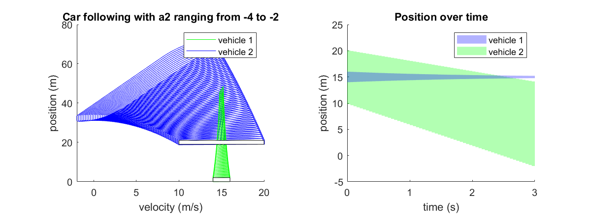
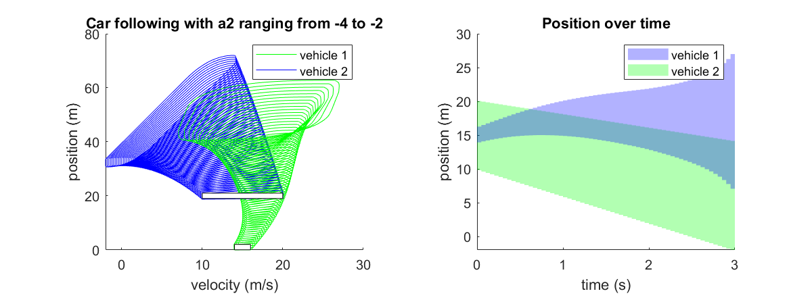

# CORA - cut-in Branch
This branch developes a vehicle cut-in simulation using CORA. Then ODD-based safety verification is applied to the reachability result.

### The cut-in scenario
The cut-in scenario involves two vehicles and two lanes. The detailed model equations can be found in `Two_vehicle_model_cut_in.pdf`.

### Baby-step 1: choose a template to work on
The `example_nonlinear_reach_05_autonomousCar.m` example is the most tempting example to use as a template for the obvious reason: it has a vehicle model. However, it happens to be the most complex example in the toolbox. This example involves Jacobian, Hessian, Tensor, all are advanced tricks to help solve a complex system. Therefore it is challenging as a first example to work on.

Alternatively, choose a relatively light-weight example, such as `example_nonlinear_reach_02_vanDerPol_polyZonotope`. This model does not involve auxiliary Jacobian, Hessian, and Tensor model files.

Since the cut-in model is rather complex, we are better-off to start with a simple vehicle model. And we chose a two vehicle car-following model with the IDM controller for the ego vehicle.

### Baby-step 2: Car-following model
We implemented the simpler two vehicle car-following model (see [here](/Two_vehicle_model_car_follow)for details). And we have some initial reachable set plots:

Only constant-speed cruise:

Adding a somewhat distance-keeping term:

